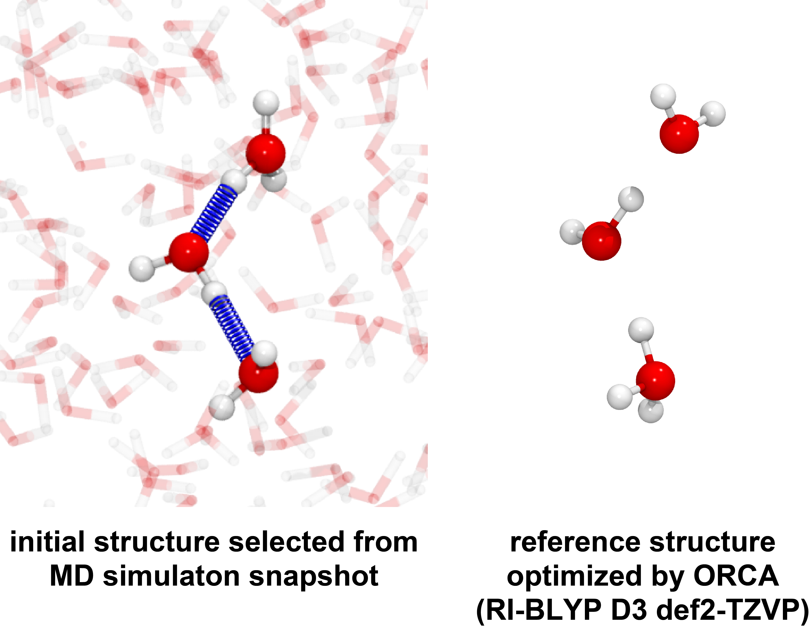

# PaCS-Q (dev)
PaCS-Q is a Python toolkit designed to assist with Parallel Cascade Selection simulations (PaCS) for studying protein structural transitions in MD and QM/MM MD levels.

Welcome to PaCS-Q v1.0.9 by L.Duan 2025.4.28

**PaCS-Q** is a Python toolkit designed to assist with
Parallel Cascade Selection simulations (PaCS) for studying
protein structural transitions in MD and QM/MM MD level.

## Please cite paper:
1. Lian Duan, Kowit Hengphasatporn, Ryuhei Harada, Yasuteru Shigeta. JCTC https://doi.org/10.1021/acs.jctc.5c00169
2. Lian Duan, Kowit Hengphasatporn, Yasuteru Shigeta. JCIM https://doi.org/xx.xxx/acs.jcim.xxxxx

                    ██████╗░░█████╗░░█████╗░░██████╗░░░░░░░░░██████╗░
                    ██╔══██╗██╔══██╗██╔══██╗██╔════╝░░░░░░░░██╔═══██╗
                    ██████╔╝███████║██║░░╚═╝╚█████╗░░█████╗║██╗██░██║
                    ██╔═══╝░██╔══██║██║░░██╗░╚═══██╗░╚════╝░╚██████╔╝
                    ██║░░░░░██║░░██║╚█████╔╝██████╔╝░░░░░░░░░╚═██╔═╝░
                    ╚═╝░░░░░╚═╝░░╚═╝░╚════╝░╚═════╝░░░░░░░░░░░░╚═╝░░░

## Prerequisites
**Before installing and running PaCS-Q, ensure you have the following:**

- **AMBER** (version 22 or later) compiled with **MPI(sander.MPI)** support and **CUDA(pmemd.cuda)** support
- **Miniconda** (for environment management)
- Python packages:
  - [MDAnalysis](https://www.mdanalysis.org/)

## Installation
### 1. Download the Toolkit
**Using the following command:**
```python
pip install PaCS-Q
```

### 2. Create and Activate Conda Environment (recommend this setting for the supercomputer's queueing system)
```bash
conda create -n pacs-q
conda init
conda activate pacs-q
```

### 3. Input Files
- For LB-PaCS-MD (Distance-based PaCS-Q)
        Topology file from (.top) tLEaP and the coordinate file (.rst or .crd) obtained from after heating up step.
        You can adjust any MD parameter in "md.in".
  
- For QM/MM MD (RMSD-based PaCS-Q)
         In this simulation we need to prepare initial and reference structures, as follows.
         Topology file from tLEaP (.top), the coordinate file (.rst or .crd) obtained from after heating up step, and reference structure in PDB file format (.pdb).
         You can adjust any MD parameter in "qmmm.in".

### 4. Extend and Generate Trajectory
- To extend the simulation, please use "--rerun" in the command line.
- To generate the trajectory and the lastframe in pdb file, please use "cpp.sh" and "pdb_last.sh".
- To clean all of MD directory, please use "clean.sh".

### 5. MD Analysis
- Generate CV and 2D-PES by "pacsana_dis_collection.py"
- PCA analysis by "pacsana_procupine.py"
- Create QM input from PaCS-Q Trajectory "pacsana_QM_input.py"

# Example
## Case I
### Introduction
The **Grotthuss mechanism** reveals the unique process by which protons move in water: water molecules first absorb an extra proton to form a hydronium ion, and this ion rapidly transfers the proton to a neighboring molecule through hydrogen bond interactions. This results in a series of consecutive proton hops that greatly enhance the efficiency of proton conduction. Today, this model has become one of the key theories for explaining fast proton conduction in water. In this work, I will reconstruct this mechanism using the PaCS-Q method.

### Preparation
As with many sampling techniques, having a good initial configuration is the key to success. Therefore, I strongly recommend that you perform initial sampling through molecular dynamics simulations, selecting a relatively appropriate hydrogen-bond network from the simulation for your study. There are already plenty of tutorials available on molecular dynamics, so I will not take up the space here to describe how molecular dynamics is carried out. Through molecular dynamics, we can obtain a topology file ([.top](case_1/H3O.top)).

As shown in the figure, we selected a short hydrogen-bond network from the molecular dynamics trajectory file, and saved the coordinates of that frame (in a [.rst](case_1/H3O.rst) file).

Since we need to study the process of proton transfer, we optimize the structure after the reaction using any QM software (in this example, ORCA 6.0 is used), examine the optimized structure, and save it as a PDB file. **It is important to emphasize that the number of atoms and the order of atoms in each residue in the PDB file must be identical to those in the topology file—even if the proton has transferred and no longer belongs to that residue, the atom must still be included within the original residue range.**



In addition, users are required to prepare their own [qmmm.in](case_1/qmmm.in) file.
We recommend adopting the same settings as used in this study for the cntrl section, specifically employing a short simulation time and a small timestep. Such settings allow for more frequent random reseeding of velocities, thereby accelerating the system’s ability to cross chemical reaction barriers. It is particularly important to note that **if the simulation involves proton transfer, the SHAKE algorithm should be disabled to prevent constraints from affecting proton dynamics.** In the qmmm section, users must correctly specify the qmmask (defining the QM region), the QM calculation method, and the total charge of the QM region. For more detailed instructions regarding parameter settings, please refer to the [AMBER24 official manual](https://ambermd.org/doc12/Amber24.pdf).

With this, the initial preparation stage is complete.
The four required files are: the input files [top](case_1/H3O.top) and [rst](case_1/H3O.rst), the [qmmm.in file](case_1/qmmm.in) for the QM/MM simulation, and the [ref.pdb](case_1/ref.pdb) file used as the reference for the final structure.

### Run PaCS-Q!
The PaCS-Q simulation can be easily initiated with a single command line:

```bash
pacs_q -cy 400 -cd 5 -r ref.pdb -s “resid 1 151 225” -qm qmmm.in
```
Here, -cy specifies the number of cycles, -cd specifies the number of candidates, -r designates the filename of the reference PDB file, and -s defines the selection region for RMSD calculations.
Please note that **the selected region for RMSD calculation is different from the QM/MM region; you may choose a larger or smaller region based on your needs.**
The selection syntax follows the same [logic as used in MDAnalysis](https://docs.mdanalysis.org/stable/documentation_pages/selections.html).
The -qm option specifies the filename containing the QM/MM settings.
For more detailed information, please refer to the help message by running pacs_q -h.

If you are using a supercomputer, we provide two job script examples for different queueing systems:

**1. SLURM system**
```bash
#!/bin/bash
#SBATCH --job-name=PaCSQ             # specific job name
#SBATCH --ntasks=4                   # specific number of tasks
#SBATCH --time=24:00:00              # job time limit <hr:min:sec>
#SBATCH --gres=gpu:0
#SBATCH --cpus-per-task=1             # specific number of CPUs per task
#SBATCH --mem=20GB                   # specific memory allocation
#SBATCH --partition=active           # specific partition

module load amber/22
source /data/home/hmahedi/miniconda3/bin/activate
conda activate pacsq
python3 /data/home/hmahedi/Workshop_PaCS_Q/PaCS-Q/PaCSQ_for_workshop/pacs_q_test.py -cy 400 -cd 5 -r ref.pdb -s "resid 1 151 225" -qm qmmm.in
```

**2. PBS system (based on the IMS supercomputer in Japan)**
```csh
#!/bin/csh -f
#PBS -l select=1:ncpus=40:mpiprocs=40:ompthreads=1
#PBS -l walltime=128:00:00 

if ($?PBS_O_WORKDIR) then
  cd ${PBS_O_WORKDIR}
endif
source /etc/profile.d/modules.csh
module -s purge
module -s load amber/24u1
source /apl/conda/20240305/conda_init.csh
conda activate myenv
python3 /data/home/hmahedi/Workshop_PaCS_Q/PaCS-Q/PaCSQ_for_workshop/pacs_q_test.py -cy 400 -cd 5 -r ref.pdb -s "resid 1 151 225" -qm qmmm.in
```
Users should choose the appropriate script based on the job scheduling system of their supercomputer. **Please note that when using the PaCS-Q suite on a supercomputer, it is recommended to use absolute paths to avoid file path errors during job execution.**

This example will typically complete within approximately 15 minutes. Upon completion, the following files will be automatically generated:
cpp.sh: A script that uses cpptraj to concatenate the sampled trajectories into a single trajectory file.
dis_plot.dat: A data file for monitoring changes in RMSD or distance values.
dis.dat: Another data file for monitoring RMSD or distance values, which can be visualized using Gnuplot.
clean.sh: A script to remove all trajectory files and other files generated during the run.
pdb_last.sh: A script to generate a PDB file of the final frame.

After executing `./cpp.sh`, the following trajectory files will be generated.
Please note that if you are using a supercomputer, you must first load the appropriate AMBER environment (e.g., module load amberXXX) before running the script.

https://github.com/user-attachments/assets/83b31342-c4d2-43cc-993e-b9a7534d26a2

## Case II
### Introduction
In the second example, we select a reaction in which a chorismate is converted into a prephenate through an enzyme-catalyzed process. This is an intramolecular reaction catalyzed by chorismate mutase. Chorismate mutase facilitates the conversion of chorismate into prephenate by lowering the activation energy barrier of the reaction.

### Preparation
The preparation steps are the same as those described in Case I and will not be repeated here. We prepared the force field parameters for chorismate and generated the corresponding [top](/case_2/case_2.top) and [crd](/case_2/case_2.crd) files using tLEaP. Similarly, the optimized structure of prephenate was obtained using ORCA and used as the [reference structure](/case_2/ref.pdb). The QM region was also defined in the [qmmm.in](/case_2/qmmm.in) file.

### Run PaCS-Q!
The PaCS-Q simulation can be easily initiated with a single command line:
```bash
pacs_q -cy 3000 -cd 5 -r ref.pdb -s “resid 349” -qm qmmm.in
```
Since this reaction is more complex than the previous case, we performed the simulation using 3000 cycles. Running this simulation may take approximately 2 to 3 hours.


## Case III （LB-PaCS MD via PaCS-Q）


## For More Detail of PaCS-Q Usage:
pacs_q.py -h
                      

  
